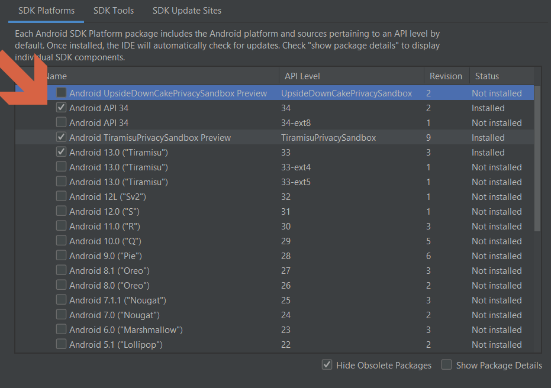

# Instalación de Flutter En Windows

# Introducción a Flutter

[Flutter - Build apps for any screen](https://flutter.dev/)

## Instalación de Android Studio

1. Descargue e instale [Android Studio](https://developer.android.com/studio?hl=es-419).
2. Inicia Android Studio y sigue las instrucciones del asistente de configuración de Android Studio. Esto instala la última versión de Android SDK, Android SDK Command-line Tools, y Android SDK Build-Tools, que son requeridos por Flutter cuando se desarrolla para Android.
3. Ejecute `flutter doctor` para confirmar que Flutter ha localizado su instalación de Android Studio. Si Flutter no puede localizarlo, ejecute  `flutter config --android-studio-dir=<directory>`  para establecer el directorio en el que está instalado Android Studio.

## Instalación de Flutter

Para instalar y ejecutar Flutter, su entorno de desarrollo debe cumplir estos requisitos mínimos:

1. Sistemas operativos: Windows 10 o posterior (64 bits), basado en x86-64.
2. Espacio en disco: 2,5 GB (no incluye espacio en disco para IDE/herramientas).
3. Herramientas: Flutter depende de que estas herramientas estén disponibles en su entorno.
    1. Windows PowerShell 5.0 o posterior (viene preinstalado con Windows 10)
    2. Git para Windows 2.x, con la opción Usar Git desde el símbolo del sistema de Windows.
    3. Si Git para Windows ya está instalado, asegúrese de que puede ejecutar comandos git desde el símbolo del sistema o PowerShell.

### Obtenga el SDK de Flutter

Descargue el siguiente paquete de instalación para obtener la última versión estable del SDK de Flutter:

[Descargar Flutter 3.13.9 stable](https://storage.googleapis.com/flutter_infra_release/releases/stable/windows/flutter_windows_3.13.9-stable.zip)

Para otros canales de lanzamiento y versiones anteriores, consulte el [archivo SDK](https://docs.flutter.dev/release/archive?tab=windows).

Extraiga el archivo zip y coloque el contenido en la ubicación de instalación deseada para el SDK de Flutter (por ejemplo, %USERPROFILE%\flutter, D:\dev\flutter).

<aside>
⚠️ No instale Flutter en una ruta que contenga caracteres especiales o espacios.

</aside>

<aside>
⚠️ No instale Flutter en un directorio como C:/Archivos de programa/ que requiera privilegios elevados.

</aside>

## Actualice su ruta (Variable de entorno Path)

- En la barra de búsqueda de Inicio, introduzca '`env`' y seleccione Editar variables de entorno para su cuenta.
- En Variables de usuario compruebe si hay una entrada llamada PATH:
- Si la entrada existe, añada la ruta completa a `flutter\bin` utilizando `;` como separador de los valores existentes.
- Si la entrada no existe, cree una nueva variable de usuario llamada PATH con la ruta completa a `flutter\bin` como valor.

<aside>
💡 Tienes que cerrar y volver a abrir cualquier ventana de consola existente para que estos cambios surtan efecto.

</aside>

<aside>
💡 El SDK de Flutter contiene el comando dart junto con el comando flutter para que pueda ejecutar más fácilmente programas de línea de comandos Dart. Al descargar el SDK de Flutter también se descarga la versión compatible de Dart, pero si ha descargado el SDK de Dart por separado, asegúrese de que la versión de Flutter de dart es la primera en su ruta, ya que las dos versiones podrían no ser compatibles. El siguiente comando le dice si los comandos flutter y dart se originan en el mismo directorio bin y por lo tanto son compatibles.

</aside>

## Correr `flutter doctor`

## Emuladores

1. Accedemos a Virtual Device Manager en Android Studio
2. Click en Create a Device
3. Click en New Hardware Profile

1. Click en Next

1. Click en Next hasta terminar.

## Crear un proyecto Flutter

1. Abrimos Visual Studio Code
2. Instalamos el plugin **Flutter** de **Dart Code**

1. Reiniciamos VSCode
2. Abrimos ***Command Palette*** (Ctrl * Shit + P)
3. Seleccionamos ***New Project***, Luego ***Application***.

## Correr la aplicación de ejemplo en nuestro Emulador

1. Accedemos nuevamente al ***Command Palette***
2. Escribimos `flutter`
3. Seleccionamos la opción Flutter: Select Device, luego hacemos click sobre el emulador previamente creado.

1. Teniendo abierto el archivo `main.dart` de nuestro proyecto presionamos ***F5***, para ejecutarlo. La primera vez que lo ejecutemos se demora mucho, luego será mas rápido. 

